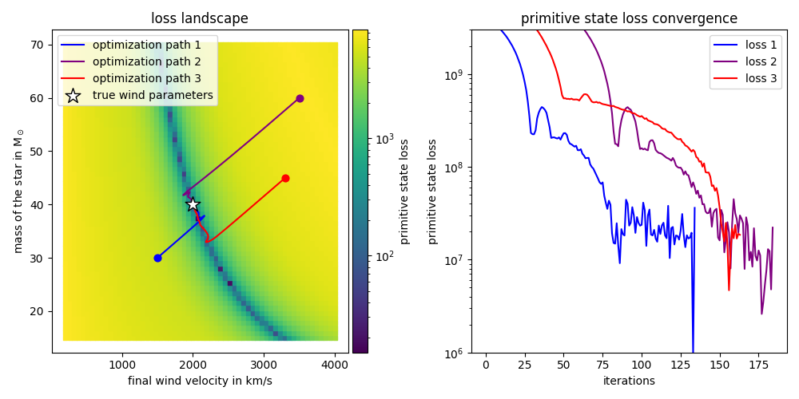

# jf1uids - differentiable (magneto)hydrodynamics for astrophysics in JAX

[](https://doi.org/10.5281/zenodo.15052815)

## Features

- [x] 1D, 2D and 3D hydrodynamics and magnetohydrodynamics simulations
- [x] provably divergence free magnetic fields based on the approach of [Pang and Wu (2024)](https://arxiv.org/abs/2410.05173) (different from their approach not yet provably positivity preserving)
- [x] novel (possibly) conservative self gravity scheme, stable at strong discontinuities
- [x] spherically symmetric simulations such that mass and energy are conserved based on the scheme of [Crittenden and Balachandar (2018)](https://doi.org/10.1007/s00193-017-0784-y)
- [x] backwards and forwards differentiable with adaptive timestepping
- [x] easily extensible, all code is open source

## Installation

`jf1uids` can be installed via `pip`

```bash
pip install jf1uids
```

Note that if `JAX` is not yet installed, only the CPU version of `JAX` will be installed
as a dependency. For a GPU-compatible installation of `JAX`, please refer to the
[JAX installation guide](https://jax.readthedocs.io/en/latest/installation.html).

## Notebooks for Getting Started

- hydrodynamics
  - [1d shock tube](notebooks/hydrodynamics/simple_example.ipynb)
  - [1d spherical check of conservational properties](notebooks/hydrodynamics/conservational_properties.ipynb)
  - [2d Kelvin-Helmholtz instability](notebooks/hydrodynamics/kelvin_helmholtz.ipynb)
- magnetohydrodynamics
  - [2d Orszag-Tang vortex](notebooks/magnetohydrodynamics/orszag_tang_vortex.ipynb)
- self-gravity
  - [3d simulation of Evrard's collapse](notebooks/self_gravity/evrards_collapse.ipynb)
- stellar wind
  - [1d stellar wind with gradient showcase](notebooks/stellar_wind/gradients_through_stellar_wind.ipynb)
  - [1d stellar wind with parameter optimization](notebooks/stellar_wind/wind_parameter_optimization.ipynb)
  - [3d stellar wind](notebooks/stellar_wind/stellar_wind3D.ipynb)

## Showcase

|  |  |
|:------------------------------------------------------------------:|:-------------------------------------------------:|
| Orszag-Tang Vortex                                                 | 3D Collapse                                       |

|  |
|:---------------------------------------------------------------------------------------:|
| Gradients Through Stellar Wind                                                          |

|  |
|:-----------------------------------------------------------------------------------------------------------------------------------:|
| Novel (Possibly) Conservative Self Gravity Scheme, Stable at Strong Discontinuities                                                 |

|  |
|:---------------------------------------------------------------------------------:|
| Wind Parameter Optimization                                                       |


## Citable References

We have currently only published on the previous 1d-only version of this code.

[Storcks, L., & Buck, T. (2024). Differentiable Conservative Radially Symmetric Fluid Simulations and Stellar Winds--jf1uids. arXiv preprint arXiv:2410.23093.](https://arxiv.org/abs/2410.23093)